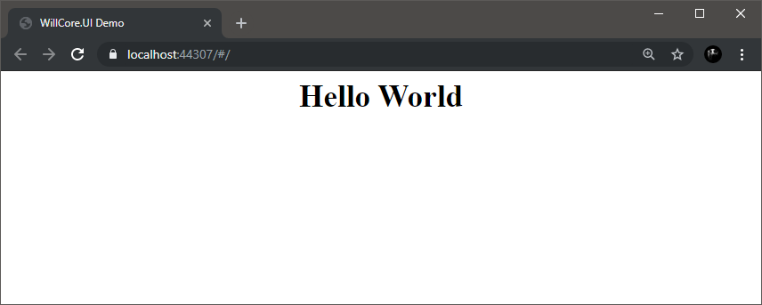
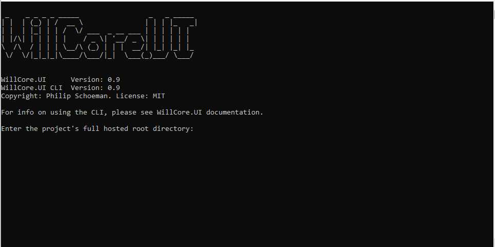
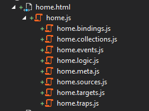

<p align="center">

<h1 align="center">WillCore.UI</h1>
<h5 align="center">Simple, Fast And Powerfull Client-Side HTML UI Framework</h5>
<h5 align="center" style="color:red">DOCUMENTATION IS A WORK IN  PROGRESS.</h5>
</p>

___

> WillCore.UI is a framework that makes building a client-side rendered single paged application easy. Fast and small, but yet powerful, it requires no pre-compilers and everything is coded in ES6.

___

### Why Another JavaScript Framework?

KISS. Keep it simple stupid. With so many JS UI frameworks popping up, it is hard to keep up to date with all the new front-end libraries. Most of them are over complicated, requires pre-compilers, and take ages just to set them up. That is why WillCore.UI was born, a simple but yet powerful framework was needed to not only build websites, but also PWAs with offline functionality.

###### WillCore.UI has a simple API and can be learned in a day (disclaimer: excluding people with impaired cognitive functionality). 
___
> ### Index
___
1. [Assignable Introduction](#assignable)
2. [Getting Started](#gettingStarted)
   * [Without CLI]()
   * [With CLI]()
2. [The Index File](#indexFile)
3. [Views](#views)
4. [Collections And Model Binding](#collections)
5. [Events](#events)
6. [View Layouts](#layouts)
7. [Partial Views](#partials)
8. [HTML DOM Binders In Detail](#dombinders)
10. [HTTP requests](#requests)
11. [Routing](#routing)
12. [Collection Targets And Sources](#targetssources)

___
> ### 1) Assignable Introduction
___

In order to make the API as simple as possible, WC.UI (WillCore.UI) uses the concept of assignables to instantiate and assign state to internal objects. The concept might be a bit weird at first, but it simplifies the API.

<br/>

E1) Let's take the following example:

```javascript
//Creates an instance of the attribute class and assign values to it.
view.$elementId.attribute = new attribute(view);
//Assign the attributeField property on the instance
view.$elementId.attribute.attributeField = "style";
//Assign the value function on the attribute instance
view.$elementId.attribute.valueFunction = () => ({ color: "red" });
```

In the example above we use traditional Class or Function instantiation and then we assign properties to the instance. But by doing so we are expecting the programmer to know the API and what values to assign. But what if the class itself knew what values to assign where? That is where assignables come in.

<br/>

E2) Doing it the assignable way:

```javascript
//Assigning the class "attribute", the framework knows how to create an instance and where it should live.
view.$elementId = attribute;
//Assigning the attribute field to the attribute.
view.$elementId = "style";
//Assigning the value function.
view.$elementId = () => ({ color: "red" });
```
<br/>

>The two examples above do the exact same thing. 
When the class is assigned to $elementId, the framework checks if the class inherits from an assignable. Then it creates an instance of the attribute class. The instance of the attribute class then tells WillCore.UI that it needs 1 string and 1 function to complete assignment. When the string and function is assigned, the attribute class initiates itself and the instance is removed from 
the $elementId object.

<br/>

E3) The assignable and it's properties can also be assigned via an array:

```javascript
view.$elementId = [attribute,"style", () => ({ color: "red" })];
```

<br/>

E4) Dot notation can be used on the assignable and string fields:

```javascript
view.$elementId.attribute.style = () => ({ color: "red" });
```
<br/>

Examples 2,3 and 4 all do the same thing. Assignables are the core of WillCore.UI's API and all interaction with the framework is done via assignables.

___
> ### 2) Getting Started
___

A simple, "Hello World" application to demonstrate how to setup a WillCore.UI website.

#### Without CLI

1. Make a new website in your web server (IIS or Apache) and copy the willCore.UI modules [(from here)](https://github.com/PhilipCoder/WillCore.UI/tree/master/WillCore.UI/wwwroot/willCore) to a folder named willCore in the root of your website.
2. First we have to create an index HTML page. This page servers as a main entry point to your application as well as a default layout page. Create a file, "index.html", in the root of the website with the following contents:

```html
<!DOCTYPE html>
<html>
<head>
    <meta charset="utf-8" />
    <title>WillCore.UI Demo</title>
    <script type="module" defer src="/index.js"></script>
</head>
<body>
    <div id="mainContentDiv">
    </div>
</body>
</html>
```

3. Next we have to create the index JavaScript module. This module defines views, layouts, authorization and routing to views. Create a file, "index.js", in the root of your website:

```javascript
import { willCore, url, route } from "./willCore/WillCore.js";
//Define the home page view. The view should load into the div with ID "mainContentDiv", load when the route is "/" and users should always have access to it.
willCore.loginPage = [willCore.$mainContentDiv, url, "/home.js", url, "/home.html", route, "/", x => true];
//Navigate to the home page
willCore("/");
```

4. We have now defined the view container of the SPA. Next we actually have to create the files for the home page view. Create a file home.html in the route of your website:

```html
<!--- Inline CSS == "BAD". This is only for demo purposes. --->
<div style="text-align:center">
    <h1 id="greetingOutput"></h1>
</div>
```

5. Lastly we have to create the JS for the view. Create a file "home.js", also in the root of the website:

```javascript
//A view module must always export a function
var view = async (view) => {
    //Define a collection:
    view.greeting = { message: "Hello World" };
    //Binds the heading's inner HTML to the property on the collection:
    view.$greetingOutput.innerHTML = () => view.greeting.message;
};

export { view };
```

<br/>

Open the website, you should see the following page:




_The source files for this example can be downloaded [here](https://github.com/PhilipCoder/WillCore.UI/tree/master/Example.WithoutCLI)._

#### With CLI

WillCore.UI has a CLI that can be used to create the index file, views, layouts and download the WillCore source files. It also provides intellise support for Visual Studio, configures the correct file nesting for a solution and enforces a good code structure.

1. Download the CLI from [here](https://github.com/PhilipCoder/WillCore.UI/raw/master/WillCore.UI/Dist/CLI.zip) (*make sure you have the latest .NET Core Runtime installed*). Extract the zip file to a directory and run the .exe as administrator.
2. You should see the following window:



3. Paste the path to the root directory of your website into the CLI and press enter. Keep the CLI open while you work.
4. Create a new "index.html" file in the root of your website. The CLI should have created an index.js file.
5. Create a new "home.html" file in the root of your website. The CLI should have created the following files:
6. The CLI should have created the following files:



7. Replace the content of the home.html file with the following:

```html
<!--- Inline CSS == "BAD". This is only for demo purposes. --->
<div style="text-align:center">
    <h1 id="greetingOutput"></h1>
</div>
```

8. Next we need to define the data collection. Edit the home.collections.js file and add the following line to the collection function:

```javascript
 view.greeting = { message: "Hello World" };
```

The home.collections.js file should now look like this:

```javascript
/**
 * Builds up the collections that are used by the view.
 * 
 * @typedef {import("./home.meta.js").viewMetaData} view
 * @param {view} view
 * @param {object} configuration
 */
var collections = async (view, configuration) => {
    view.greeting = { message: "Hello World" };
};

export { collections };
```

9. To add the binding, edit home.bindings.js and add this line to the bindings function:

```javascript
    view.$greetingOutput.innerHTML = () => view.greeting.message;
```

The home.bindings.js file should now look like this:

```javascript
/**
 * Binds the HTML elements to the collections.
 * Binding module
 * 
 * @typedef {import("./home.meta.js").viewMetaData} view
 * @param {view} view
 */
var bindings = async (view) => {
    view.$greetingOutput.innerHTML = () => view.greeting.message;
};

export { bindings };
```

10. Uncomment the commented out line in index.js:

```javascript
import { willCore, url, route, layout } from "./willCore/WillCore.js";

willCore.home = [willCore.$mainContentDiv, url, "/home.js", url, "/home.html", route, "/", x => true];

willCore("/");
```

11. Now we need the WillCore.UI modules. Simply make a folder named "willCore" in the root of your website. The CLI should now have added the source files to the folder.

<br/>

Open the website, you should see the following page:


_The source files for this example can be downloaded [here](https://github.com/PhilipCoder/WillCore.UI/tree/master/Example.WithoutCLI)._